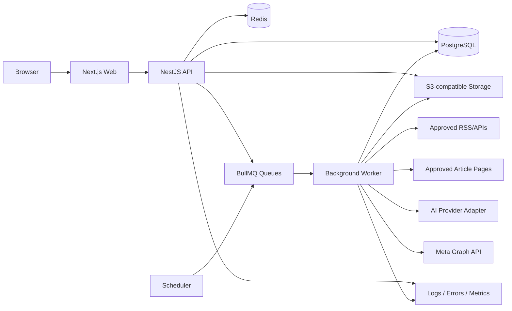

# NEWSFLOW AI — PRODUCTION PRODUCT & ENGINEERING SPECIFICATION

> **Document purpose:** This file is the single source of truth for an AI coding agent to design, implement, test, deploy, and document a production-grade SaaS product that collects recent news from approved sources, creates original Facebook-ready editorial drafts, allows a human editor to review them, and publishes approved posts to connected Facebook Pages.
>
> **Working product name:** NewsFlow AI  
> **Initial niche:** Football news and the Vietnamese Facebook Page “Bóng Đá Hôm Nay”  
> **Product direction:** Multi-tenant SaaS that can be sold to page owners, agencies, news curators, sports communities, local media teams, and content operators.
>
> **Primary UI language:** Vietnamese  
> **Code, database names, API names, and technical documentation:** English  
> **Default timezone:** `Asia/Ho_Chi_Minh`  
> **Document version:** 1.0  
> **Prepared date:** 2026-07-12

---

## 0. MANDATORY INSTRUCTIONS FOR THE CODING AGENT

The coding agent MUST treat every requirement marked **MUST** as mandatory.

### 0.1 Execution rules

1. Build a real production-oriented system, not a static UI demo.
2. Use TypeScript in strict mode throughout the project.
3. Do not place the whole project in one application file.
4. Do not use `any` except where an external library forces it, and document each exception.
5. Do not hardcode credentials, Page IDs, access tokens, tenant IDs, URLs, or API secrets.
6. Do not store Facebook access tokens in plaintext.
7. Do not publish a post automatically unless the configured workflow explicitly allows it.
8. The default workflow MUST require human approval before publishing.
9. Do not scrape arbitrary websites by default.
10. Prefer official RSS feeds, official APIs, and explicitly approved sources.
11. Never bypass paywalls, login walls, robots restrictions, rate limits, or anti-bot systems.
12. Do not copy full news articles into generated Facebook posts.
13. Generated content MUST contain meaningful original editorial value, not synonym replacement.
14. Preserve names, numbers, dates, quotations, and match results exactly.
15. Never fabricate quotations.
16. Every publishing request MUST be idempotent.
17. Every tenant-owned database record MUST be tenant-isolated.
18. Every sensitive action MUST create an audit log.
19. All critical workflows MUST include automated tests.
20. The repository MUST include local development instructions, production deployment instructions, migrations, seed data, `.env.example`, and Docker support.
21. The agent MUST implement the project in phases described in this document and keep the application runnable after each phase.
22. Use only stable package releases. Do not use beta, canary, nightly, or release-candidate packages.
23. Pin dependencies in the lockfile.
24. If a Meta API detail differs from this specification, follow the newest official Meta documentation and record the change in `docs/decisions/`.
25. Do not remove security or compliance requirements merely to make the first build easier.

### 0.2 Expected output from the coding agent

The completed repository MUST contain:

- Working web application
- Working backend API
- Working background worker
- PostgreSQL migrations
- Redis-backed job queues
- Local Docker Compose environment
- Production Dockerfiles
- Unit tests
- Integration tests
- End-to-end tests for critical flows
- API documentation
- Seeded demo account and demo tenant
- Sample approved RSS sources
- Meta connection setup guide
- Admin guide
- Deployment guide
- Backup and restore guide
- Privacy Policy template
- Terms of Service template
- Source usage and copyright policy
- Incident response checklist
- Changelog

---

# 1. PRODUCT VISION

NewsFlow AI helps a Facebook Page team discover important new stories quickly, transform verified facts into original social-media content, review the result, and publish it to the Page from one dashboard.

The system is not a “copy news and rewrite words” bot. It is an editorial workflow platform with:

- Source control
- News ingestion
- Duplicate detection
- Fact extraction
- Multi-source comparison
- AI-assisted drafting
- Originality controls
- Human approval
- Facebook Page publishing
- Scheduling
- Analytics-ready event tracking
- Team roles
- Audit history
- SaaS billing and usage limits
- White-label capability

## 1.1 Core product promise

> “From trusted news source to reviewed Facebook post in under three minutes, without copying the original article.”

## 1.2 Target customers

### Initial customer

The owner/editor of a Vietnamese football fanpage who wants to:

- Find the latest football news
- Avoid manually opening many news websites
- Produce consistent posts
- Review content before publication
- Publish directly to a Facebook Page
- Track which source and article produced each post

### Future customers

- Social media agencies
- Multi-page operators
- Sports communities
- Technology news pages
- Entertainment pages
- Local tourism pages
- University media teams
- Small digital publishers
- Brand content teams

## 1.3 Business model

The product MUST support subscription plans and usage quotas.

Suggested initial plans:

| Plan       | Connected Pages |            Sources | AI drafts/month | Team members | White-label |
| ---------- | --------------: | -----------------: | --------------: | -----------: | ----------- |
| Free Trial |               1 |                  5 |              20 |            1 | No          |
| Starter    |               1 |                 20 |             200 |            2 | No          |
| Pro        |               5 |                100 |           1,000 |           10 | No          |
| Agency     |              25 | Unlimited fair-use |           5,000 |           50 | Optional    |
| Enterprise |          Custom |             Custom |          Custom |       Custom | Yes         |

Pricing values are intentionally excluded from the code. Billing prices MUST be configuration/database driven.

---

# 2. PRODUCT BOUNDARIES

## 2.1 In scope for version 1

- Email/password authentication
- Multi-tenant organizations/workspaces
- Team invitations and roles
- RSS/Atom source management
- Optional article-page extraction for approved sources
- Scheduled source polling
- Duplicate detection
- Story clustering
- Article detail and source preview
- AI fact extraction
- AI draft generation
- Brand voice profiles
- Draft editor
- Draft version history
- Human approval
- Immediate publishing to Facebook Pages
- Internal scheduling using job queues
- Publishing retries
- Publishing history
- Audit logs
- Usage metering
- SaaS feature gating
- Admin dashboard
- Vietnamese UI
- Responsive desktop-first design
- Docker deployment
- Monitoring and backups

## 2.2 Deferred until after version 1

- Instagram publishing
- TikTok publishing
- YouTube publishing
- Facebook Reels generation
- Automated video generation
- Mobile application
- Full social analytics dashboard
- Comment moderation
- Auto-replies
- Advanced trend prediction
- Browser extension
- Public API for customers
- Native payment provider implementation
- Fully autonomous publishing without review

Interfaces SHOULD be designed so these features can be added later without rewriting the core architecture.

## 2.3 Explicitly prohibited functionality

The product MUST NOT provide:

- Fake likes, followers, comments, views, or engagement
- Personal-profile posting automation
- Account farming
- Multi-account evasion
- CAPTCHA bypass
- Paywall bypass
- Unauthorized article copying
- Plagiarism spinning
- Automated defamatory content
- Fabricated quotes
- Hidden affiliate links
- Mass unsolicited messaging
- Credential collection for customer Facebook accounts
- Storage of Facebook passwords

---

# 3. SUCCESS METRICS

The application MUST collect internal product events that make these metrics measurable:

- Time from article ingestion to draft generation
- Time from draft generation to approval
- Time from approval to successful publication
- Draft acceptance rate
- Percentage of AI drafts edited before publication
- Publication success rate
- Duplicate suppression rate
- Source failure rate
- Cost per generated draft
- AI token usage per tenant
- Active connected Pages
- Weekly active editors
- Posts published per tenant
- Failed publication recovery rate
- Customer plan and quota utilization

Initial technical targets:

| Metric                  | Target                                        |
| ----------------------- | --------------------------------------------- |
| API availability        | 99.5% monthly                                 |
| Dashboard p95 response  | < 800 ms excluding AI requests                |
| Feed list p95 response  | < 1.5 s                                       |
| Publish job enqueue     | < 500 ms                                      |
| Successful publish rate | > 98% excluding Meta outages/token revocation |
| Duplicate publish rate  | 0                                             |
| Cross-tenant data leaks | 0                                             |
| Critical audit coverage | 100%                                          |
| RPO                     | 24 hours initially                            |
| RTO                     | 4 hours initially                             |

---

# 4. USER ROLES AND PERMISSIONS

Each user may belong to multiple workspaces.

## 4.1 Workspace roles

### Owner

- Full workspace control
- Billing
- Delete workspace
- Manage all members
- Connect/disconnect Facebook Pages
- Manage security settings
- Configure auto-approval policy
- View all audit logs

### Admin

- Manage sources
- Manage Pages
- Manage members except owner
- Configure brand profiles
- Generate, edit, approve, schedule, and publish
- View usage and audit logs

### Editor

- View articles
- Generate drafts
- Edit drafts
- Submit drafts for approval
- Schedule approved posts if permitted

### Reviewer

- Review drafts
- Approve or reject drafts
- Publish approved drafts if permitted
- Cannot change workspace settings

### Viewer

- Read-only access to articles, drafts, publishing history, and reports

## 4.2 Permission implementation

Permissions MUST be enforced on the backend. Hiding a button in the frontend is not sufficient.

Use a permission model such as:

```text
workspace.manage
workspace.delete
members.read
members.manage
sources.read
sources.manage
articles.read
drafts.read
drafts.create
drafts.edit
drafts.review
drafts.publish
pages.read
pages.manage
billing.read
billing.manage
audit.read
admin.system
```

---

# 5. CORE USER FLOWS

## 5.1 Workspace onboarding

1. User creates an account.
2. User verifies email.
3. User creates a workspace.
4. User selects content niche.
5. User selects timezone.
6. User creates a brand voice profile.
7. User adds approved RSS sources.
8. User connects a Facebook Page.
9. User runs a connection test.
10. User generates a draft from a demo article.
11. User reviews the draft.
12. User publishes or saves it.

## 5.2 Source ingestion flow

1. Scheduler determines which source is due.
2. Worker fetches RSS/Atom using conditional headers when supported.
3. Feed is parsed.
4. Entry URL is normalized.
5. System rejects blocked domains and unsafe URLs.
6. System checks exact duplicates.
7. System optionally fetches the article page if source settings allow it.
8. Main content is extracted.
9. Article metadata is normalized.
10. Content hash and similarity signals are calculated.
11. Article is saved.
12. Story clustering runs.
13. Rules assign category, priority, and language.
14. Eligible users see the new article in the dashboard.

## 5.3 Draft generation flow

1. Editor selects one article or a story cluster.
2. Editor selects Page and brand profile.
3. System creates a fact sheet.
4. System extracts:
   - People
   - Teams
   - Organizations
   - Locations
   - Dates
   - Numbers
   - Scores
   - Confirmed statements
   - Direct quotations
   - Uncertainties
5. System compares facts across sources when multiple sources exist.
6. AI creates structured draft JSON.
7. Validator checks all critical names, dates, scores, and quotations.
8. Originality/risk checks run.
9. Draft is displayed as editable content.
10. Editor edits and saves.
11. Every save creates a new version.
12. Editor submits for approval.

## 5.4 Approval flow

Draft states:

```text
DRAFT
GENERATING
READY_FOR_REVIEW
CHANGES_REQUESTED
APPROVED
SCHEDULED
PUBLISHING
PUBLISHED
FAILED
CANCELLED
ARCHIVED
```

Allowed transitions MUST be validated by a state machine.

Default:

```text
DRAFT -> READY_FOR_REVIEW -> APPROVED -> PUBLISHING -> PUBLISHED
```

A rejected draft returns to `CHANGES_REQUESTED`.

## 5.5 Publish-now flow

1. Authorized user clicks “Đăng ngay”.
2. Confirmation modal displays:
   - Target Page
   - Final message
   - Link
   - Optional image
   - Source attribution
3. User confirms.
4. Backend creates an idempotent publish job.
5. Worker locks the job.
6. Worker validates Page connection and token status.
7. Worker sends request to Meta Graph API.
8. Worker stores returned Facebook post ID.
9. Worker stores request metadata with secrets removed.
10. Worker marks job `PUBLISHED`.
11. UI receives update by polling or Server-Sent Events.
12. Audit entry is created.

## 5.6 Scheduled publishing flow

1. Authorized user selects date/time.
2. Time is stored in UTC.
3. User’s selected timezone is stored for display.
4. Queue schedules a job.
5. Worker re-validates draft approval immediately before publishing.
6. Worker publishes at the scheduled time.
7. Failed attempts follow retry policy.
8. After maximum retries, mark `FAILED` and notify workspace administrators.

---

# 6. CONTENT AND EDITORIAL POLICY

## 6.1 Source policy

Every source MUST have:

- Source name
- Domain
- Feed URL
- Source type
- Country
- Default language
- Allowed categories
- Polling interval
- Extraction permission setting
- Attribution format
- Terms/licensing notes
- Enabled/disabled status
- Trust level
- Last successful fetch
- Consecutive failure count

Source types:

```text
OFFICIAL_RSS
OFFICIAL_API
APPROVED_WEB_PAGE
MANUAL_URL
```

Default behavior:

- Official RSS or API: allowed.
- Page extraction: disabled until an administrator approves the domain.
- Unknown domain: blocked.
- Paywalled content: store metadata and public excerpt only.
- Full article body: do not persist longer than necessary unless rights permit.

## 6.2 Originality requirements

A generated post MUST add meaningful editorial value through at least one of:

- Multi-source synthesis
- Context
- Timeline
- Explanation of significance
- Statistical comparison
- Consequence for a team/player/league
- Structured summary
- Fact checking
- Original question for discussion
- Original data visualization in later versions

The system MUST reject or warn on:

- Near-copy of source title and body
- Long verbatim passages
- More than a short quotation
- Missing source attribution
- Unsupported claims
- Fabricated quotation marks
- Sensational claims not present in sources
- Misleading certainty
- Incorrect score/date/player name

## 6.3 Default Facebook post structure

```text
[Short original headline]

[2–4 concise paragraphs explaining what happened.]

[Why it matters / context / implications.]

[Question inviting real discussion.]

Nguồn tham khảo: [Source 1], [Source 2]
[Optional original article link]

#RelevantHashtag
```

The product MUST allow reusable templates by niche.

## 6.4 Football-specific editorial rules

- Match scores MUST be copied exactly from verified source facts.
- Distinguish confirmed transfers from rumors.
- Label rumors explicitly.
- Do not state injuries as confirmed without a reliable source.
- Preserve competition names.
- Use absolute dates when relative phrases could be ambiguous.
- Do not invent player quotes.
- Quotes MUST have source attribution.
- Avoid insulting players, teams, or supporters.
- Add context such as table implications only when data is available.
- Flag betting-related content for manual review.
- Flag allegations, legal disputes, and disciplinary cases as high risk.

## 6.5 High-risk content categories

The following MUST always require manual review and cannot use auto-publish:

- Crime allegations
- Legal disputes
- Health or injury diagnoses
- Death
- Politics
- Elections
- Financial claims
- Defamation risk
- Minors
- Leaked/private information
- Gambling
- Violence
- Sexual content
- Unverified rumors
- Material based on a single low-trust source

---

# 7. AI GENERATION PIPELINE

## 7.1 Provider abstraction

Create an interface:

```ts
interface AiProvider {
  extractFacts(input: FactExtractionInput): Promise<FactSheet>;
  generateDraft(input: DraftGenerationInput): Promise<GeneratedDraft>;
  verifyDraft(input: DraftVerificationInput): Promise<DraftVerificationResult>;
}
```

The application MUST not bind core business logic directly to a single AI vendor.

Configuration per workspace:

- Provider
- Model
- Temperature
- Maximum output length
- Monthly budget
- Allowed tasks
- Fallback provider
- Data retention preference

## 7.2 Fact extraction schema

```ts
type FactSheet = {
  articleId: string;
  sourceClaims: Array<{
    claimId: string;
    text: string;
    sourceArticleId: string;
    evidenceExcerpt: string;
    confidence: number;
  }>;
  entities: Array<{
    type: 'PERSON' | 'TEAM' | 'ORGANIZATION' | 'LOCATION' | 'COMPETITION';
    canonicalName: string;
    aliases: string[];
  }>;
  dates: Array<{
    value: string;
    context: string;
    confidence: number;
  }>;
  numbers: Array<{
    value: string;
    unit?: string;
    context: string;
    confidence: number;
  }>;
  quotes: Array<{
    text: string;
    speaker: string;
    sourceArticleId: string;
    confidence: number;
  }>;
  uncertaintyFlags: string[];
};
```

## 7.3 Generated draft schema

```ts
type GeneratedDraft = {
  language: 'vi' | 'en';
  headline: string;
  hook: string;
  body: string;
  whyItMatters: string;
  discussionQuestion?: string;
  hashtags: string[];
  attributionLine: string;
  recommendedLink?: string;
  contentType: 'BREAKING' | 'SUMMARY' | 'ANALYSIS' | 'RESULT' | 'RUMOR';
  sourceClaimIds: string[];
  riskFlags: string[];
  confidence: number;
};
```

AI responses MUST be parsed from validated structured JSON using a schema validator.

## 7.4 Generation prompt contract

The system prompt MUST include:

- Use only the supplied fact sheet.
- Do not add unsupported details.
- Do not invent quotations.
- Preserve names, dates, scores, and numbers.
- Explain uncertainty clearly.
- Write original content, not a paraphrase of the article.
- Use natural Vietnamese suitable for Facebook.
- Avoid clickbait that contradicts facts.
- Add context only if included in the supplied data.
- Return valid JSON matching the schema.
- Keep source attribution.
- Mark high-risk issues.

## 7.5 Verification stage

After generation, run deterministic checks before optional AI verification:

- Entity exact-match checks
- Score pattern checks
- Date checks
- Quote checks
- Number checks
- URL checks
- Maximum quotation length
- Similarity against source text
- Prohibited phrase checks
- Empty section checks
- Hashtag limit
- Character limits

Verification result:

```ts
type DraftVerificationResult = {
  passed: boolean;
  errors: Array<{
    code: string;
    message: string;
    field?: string;
  }>;
  warnings: Array<{
    code: string;
    message: string;
    field?: string;
  }>;
  unsupportedClaims: string[];
  similarityScore: number;
};
```

A failed draft cannot be approved.

## 7.6 Cost controls

- Track input/output tokens by tenant and task.
- Enforce plan quotas.
- Enforce monthly budget.
- Deduplicate identical AI requests.
- Cache fact extraction by article content hash.
- Do not regenerate facts for unchanged articles.
- Show estimated cost before batch generation.
- Admin can disable AI for a tenant.
- Set hard per-request token limits.
- Implement timeout and cancellation.

---

# 8. FACEBOOK PAGE INTEGRATION

## 8.1 Official API only

Use the official Facebook Pages API.

As of the preparation date, Meta Graph API `v25.0` is available. The version MUST remain configurable:

```env
META_GRAPH_API_VERSION=v25.0
```

Never concatenate an unvalidated user value into the Graph API hostname or version.

## 8.2 Required Meta setup

Production onboarding documentation MUST explain:

1. Create a Meta developer app.
2. Configure Facebook Login.
3. Configure valid OAuth redirect URIs.
4. Link the app to a verified business when required.
5. Add Privacy Policy URL.
6. Add Data Deletion Instructions URL.
7. Configure app domains.
8. Request required permissions/features.
9. Complete App Review for external customers.
10. Record reviewer test instructions.
11. Switch app to Live mode only after review.

Expected Page permissions include, depending on current official requirements:

- `pages_show_list`
- `pages_manage_posts`
- `pages_read_engagement`
- Additional permissions only when a feature genuinely needs them

Request the minimum permissions needed.

Video publishing is out of v1 scope. Do not request video permissions in v1.

## 8.3 Page connection flow

1. User clicks “Kết nối Facebook”.
2. Backend creates OAuth state and PKCE values.
3. State is tied to user, tenant, expiry, and one-time use.
4. User completes Facebook authorization.
5. Backend validates state.
6. Backend exchanges authorization result for user token.
7. Backend retrieves Pages the user can manage.
8. User selects one or more Pages.
9. Backend stores:
   - Page ID
   - Page name
   - Granted tasks
   - Granted scopes
   - Encrypted Page access token
   - Token health metadata
10. Backend immediately validates Page identity and publishing capability.
11. Connection status becomes `ACTIVE`.

Do not send access tokens to the browser after storage.

## 8.4 Token storage

Store token ciphertext with:

- Ciphertext
- Initialization vector
- Authentication tag
- Key version
- Last validated time
- Scope snapshot
- Token metadata

Use AES-256-GCM or a managed cloud key service.

Master encryption keys MUST not be stored in the database.

## 8.5 Publishing request

Text/link post:

```http
POST https://graph.facebook.com/{version}/{page-id}/feed
Content-Type: application/json
Authorization: Bearer {page-access-token}
```

Payload concept:

```json
{
  "message": "Final reviewed post",
  "link": "https://approved-source.example/article"
}
```

Implementation MUST follow the current official Meta documentation at coding time.

## 8.6 Publishing guarantees

- Create a unique idempotency key from tenant, Page, draft version, and requested publish time.
- Use a database uniqueness constraint.
- Worker obtains a distributed lock.
- Before retrying after an ambiguous network failure, query stored state and, where possible, reconcile with Meta response identifiers.
- Never publish the same approved draft version twice unless a user explicitly creates a new publish request.
- Do not retry permanent permission errors.
- Retry transient errors with exponential backoff and jitter.
- Maximum automatic retries: configurable, default 5.
- Store sanitized error code, subcode, and response metadata.
- Never store the token in logs.

## 8.7 Connection states

```text
PENDING
ACTIVE
NEEDS_REAUTH
INSUFFICIENT_PERMISSION
REVOKED
DISABLED
ERROR
```

The UI MUST clearly explain how to reconnect.

## 8.8 App Review readiness

The product MUST include a demo/reviewer mode that:

- Has a test workspace
- Contains sample sources
- Contains a sample draft
- Shows the connect Page flow
- Shows exactly how the permission is used
- Does not require a reviewer to configure unrelated services
- Includes screencast preparation instructions

---

# 9. SYSTEM ARCHITECTURE

## 9.1 Recommended technology stack

### Monorepo

- `pnpm`
- Turborepo or equivalent stable monorepo tooling

### Frontend

- Next.js with App Router
- React
- TypeScript strict mode
- Tailwind CSS
- Accessible component library
- TanStack Query for server state where needed
- React Hook Form
- Zod validation

### Backend API

- NestJS
- REST API
- OpenAPI/Swagger
- Zod or class-validator at boundaries
- Prisma ORM
- PostgreSQL

### Worker and queues

- Node.js/NestJS worker
- BullMQ
- Redis

### Storage

- S3-compatible object storage
- Local MinIO for development
- Signed URLs for uploads

### Infrastructure

- Docker
- Docker Compose for local development
- Reverse proxy using Caddy or Nginx
- GitHub Actions
- Managed PostgreSQL/Redis/S3 recommended for production

### Observability

- Structured JSON logging
- Sentry or equivalent error tracking
- OpenTelemetry-compatible tracing
- Health/readiness endpoints
- Prometheus-compatible metrics endpoint where practical

## 9.2 High-level architecture



## 9.3 Service boundaries

Logical modules:

- Auth
- Users
- Workspaces
- Memberships
- Sources
- Ingestion
- Articles
- Story Clustering
- Facts
- AI Generation
- Drafts
- Review
- Facebook Connections
- Publishing
- Scheduling
- Notifications
- Billing
- Usage
- Audit
- Admin
- Health

Version 1 may deploy API modules together, but code boundaries MUST allow later service extraction.

---

# 10. REPOSITORY STRUCTURE

```text
newsflow-ai/
├─ apps/
│  ├─ web/
│  │  ├─ app/
│  │  ├─ components/
│  │  ├─ features/
│  │  ├─ lib/
│  │  └─ tests/
│  ├─ api/
│  │  ├─ src/
│  │  │  ├─ modules/
│  │  │  ├─ common/
│  │  │  ├─ config/
│  │  │  └─ main.ts
│  │  └─ test/
│  └─ worker/
│     ├─ src/
│     │  ├─ processors/
│     │  ├─ schedulers/
│     │  ├─ integrations/
│     │  └─ main.ts
│     └─ test/
├─ packages/
│  ├─ database/
│  │  ├─ prisma/
│  │  └─ src/
│  ├─ contracts/
│  ├─ config/
│  ├─ ui/
│  ├─ eslint-config/
│  ├─ tsconfig/
│  └─ test-utils/
├─ docs/
│  ├─ architecture/
│  ├─ decisions/
│  ├─ operations/
│  ├─ meta-app-review/
│  ├─ privacy/
│  └─ api/
├─ infrastructure/
│  ├─ docker/
│  ├─ caddy/
│  └─ scripts/
├─ .github/workflows/
├─ docker-compose.yml
├─ .env.example
├─ pnpm-workspace.yaml
├─ turbo.json
├─ README.md
└─ CHANGELOG.md
```

---

# 11. DATABASE MODEL

Use UUID or UUIDv7 identifiers. Store all timestamps in UTC.

## 11.1 Core tables

### `users`

- `id`
- `email`
- `password_hash`
- `display_name`
- `email_verified_at`
- `status`
- `last_login_at`
- `created_at`
- `updated_at`

### `refresh_tokens`

- `id`
- `user_id`
- `token_hash`
- `family_id`
- `expires_at`
- `revoked_at`
- `replaced_by_id`
- `created_at`
- `ip_hash`
- `user_agent_hash`

### `workspaces`

- `id`
- `name`
- `slug`
- `timezone`
- `default_language`
- `status`
- `owner_user_id`
- `plan_id`
- `created_at`
- `updated_at`
- `deleted_at`

### `memberships`

- `id`
- `workspace_id`
- `user_id`
- `role`
- `status`
- `invited_by_user_id`
- `created_at`
- `updated_at`

Unique: `(workspace_id, user_id)`

### `brand_profiles`

- `id`
- `workspace_id`
- `name`
- `language`
- `tone`
- `audience`
- `writing_rules_json`
- `forbidden_phrases_json`
- `default_hashtags_json`
- `attribution_template`
- `is_default`
- `created_at`
- `updated_at`

### `news_sources`

- `id`
- `workspace_id`
- `name`
- `domain`
- `feed_url`
- `source_type`
- `language`
- `country`
- `category`
- `trust_level`
- `poll_interval_seconds`
- `allow_page_extraction`
- `attribution_name`
- `license_notes`
- `status`
- `last_polled_at`
- `last_success_at`
- `etag`
- `last_modified`
- `consecutive_failures`
- `created_at`
- `updated_at`

Unique: `(workspace_id, feed_url)`

### `articles`

- `id`
- `workspace_id`
- `source_id`
- `canonical_url`
- `original_url`
- `title`
- `summary`
- `author`
- `published_at`
- `discovered_at`
- `language`
- `category`
- `image_url`
- `content_excerpt`
- `content_hash`
- `normalized_title_hash`
- `extraction_status`
- `risk_level`
- `metadata_json`
- `created_at`
- `updated_at`

Unique: `(workspace_id, canonical_url)`

### `story_clusters`

- `id`
- `workspace_id`
- `canonical_topic`
- `category`
- `started_at`
- `last_article_at`
- `status`
- `created_at`
- `updated_at`

### `story_cluster_articles`

- `cluster_id`
- `article_id`
- `similarity_score`
- `is_primary_source`

Unique: `(cluster_id, article_id)`

### `fact_sheets`

- `id`
- `workspace_id`
- `article_id`
- `cluster_id`
- `content_hash`
- `facts_json`
- `provider`
- `model`
- `prompt_version`
- `input_tokens`
- `output_tokens`
- `created_at`

### `drafts`

- `id`
- `workspace_id`
- `cluster_id`
- `primary_article_id`
- `brand_profile_id`
- `target_page_connection_id`
- `status`
- `current_version_id`
- `created_by_user_id`
- `submitted_by_user_id`
- `approved_by_user_id`
- `approved_at`
- `created_at`
- `updated_at`
- `archived_at`

### `draft_versions`

- `id`
- `workspace_id`
- `draft_id`
- `version_number`
- `headline`
- `hook`
- `body`
- `why_it_matters`
- `discussion_question`
- `hashtags_json`
- `attribution_line`
- `recommended_link`
- `content_type`
- `risk_flags_json`
- `verification_json`
- `similarity_score`
- `created_by_type`
- `created_by_user_id`
- `provider`
- `model`
- `prompt_version`
- `created_at`

Unique: `(draft_id, version_number)`

### `draft_reviews`

- `id`
- `workspace_id`
- `draft_id`
- `draft_version_id`
- `reviewer_user_id`
- `decision`
- `comment`
- `created_at`

### `facebook_page_connections`

- `id`
- `workspace_id`
- `page_id`
- `page_name`
- `status`
- `granted_tasks_json`
- `granted_scopes_json`
- `token_ciphertext`
- `token_iv`
- `token_auth_tag`
- `token_key_version`
- `last_validated_at`
- `last_error_code`
- `connected_by_user_id`
- `created_at`
- `updated_at`

Unique: `(workspace_id, page_id)`

### `publish_jobs`

- `id`
- `workspace_id`
- `draft_id`
- `draft_version_id`
- `page_connection_id`
- `status`
- `publish_at`
- `idempotency_key`
- `attempt_count`
- `facebook_post_id`
- `facebook_permalink`
- `last_error_code`
- `last_error_message`
- `created_by_user_id`
- `created_at`
- `updated_at`
- `published_at`

Unique: `idempotency_key`

### `publish_attempts`

- `id`
- `workspace_id`
- `publish_job_id`
- `attempt_number`
- `started_at`
- `finished_at`
- `http_status`
- `provider_error_code`
- `provider_error_subcode`
- `sanitized_response_json`
- `success`

### `usage_events`

- `id`
- `workspace_id`
- `user_id`
- `event_type`
- `quantity`
- `unit`
- `metadata_json`
- `occurred_at`

### `plans`

- `id`
- `code`
- `name`
- `limits_json`
- `features_json`
- `status`

### `subscriptions`

- `id`
- `workspace_id`
- `plan_id`
- `provider`
- `provider_customer_id`
- `provider_subscription_id`
- `status`
- `current_period_start`
- `current_period_end`
- `cancel_at_period_end`
- `created_at`
- `updated_at`

### `audit_logs`

- `id`
- `workspace_id`
- `actor_user_id`
- `actor_type`
- `action`
- `resource_type`
- `resource_id`
- `ip_hash`
- `user_agent_hash`
- `before_json`
- `after_json`
- `created_at`

Audit logs MUST be append-only from application code.

### `system_jobs`

- `id`
- `job_type`
- `status`
- `deduplication_key`
- `payload_json`
- `scheduled_at`
- `started_at`
- `finished_at`
- `attempts`
- `last_error`

---

# 12. MULTI-TENANCY REQUIREMENTS

1. Every workspace-owned record MUST include `workspace_id`.
2. Workspace ID MUST come from authenticated context, not from an untrusted request body alone.
3. Every repository/service query MUST scope by workspace.
4. Add automated tests attempting cross-workspace access.
5. Background jobs MUST include workspace ID and verify it again when executed.
6. Object storage keys MUST begin with workspace ID.
7. Cache keys MUST include workspace ID.
8. Rate limits MUST be tenant-aware.
9. Admin impersonation, if later added, MUST be explicit, time-limited, visible, and audited.
10. Hard deletion MUST be restricted. Prefer soft deletion and retention jobs.

---

# 13. BACKEND API

Prefix routes with:

```text
/api/v1
```

## 13.1 Auth

```text
POST   /auth/register
POST   /auth/login
POST   /auth/refresh
POST   /auth/logout
POST   /auth/verify-email
POST   /auth/forgot-password
POST   /auth/reset-password
GET    /auth/me
```

## 13.2 Workspaces and members

```text
GET    /workspaces
POST   /workspaces
GET    /workspaces/:workspaceId
PATCH  /workspaces/:workspaceId
DELETE /workspaces/:workspaceId

GET    /workspaces/:workspaceId/members
POST   /workspaces/:workspaceId/invitations
PATCH  /workspaces/:workspaceId/members/:memberId
DELETE /workspaces/:workspaceId/members/:memberId
```

## 13.3 Sources

```text
GET    /workspaces/:workspaceId/sources
POST   /workspaces/:workspaceId/sources
GET    /workspaces/:workspaceId/sources/:sourceId
PATCH  /workspaces/:workspaceId/sources/:sourceId
DELETE /workspaces/:workspaceId/sources/:sourceId
POST   /workspaces/:workspaceId/sources/:sourceId/test
POST   /workspaces/:workspaceId/sources/:sourceId/poll
```

## 13.4 Articles

```text
GET    /workspaces/:workspaceId/articles
GET    /workspaces/:workspaceId/articles/:articleId
POST   /workspaces/:workspaceId/articles/manual-url
POST   /workspaces/:workspaceId/articles/:articleId/extract-facts
POST   /workspaces/:workspaceId/articles/:articleId/archive
```

Filters:

- Source
- Category
- Date range
- Risk
- Language
- Search
- Cluster
- Draft status
- Unread/read

Use cursor pagination.

## 13.5 Drafts

```text
GET    /workspaces/:workspaceId/drafts
POST   /workspaces/:workspaceId/drafts
GET    /workspaces/:workspaceId/drafts/:draftId
POST   /workspaces/:workspaceId/drafts/:draftId/generate
PATCH  /workspaces/:workspaceId/drafts/:draftId
POST   /workspaces/:workspaceId/drafts/:draftId/submit
POST   /workspaces/:workspaceId/drafts/:draftId/approve
POST   /workspaces/:workspaceId/drafts/:draftId/request-changes
POST   /workspaces/:workspaceId/drafts/:draftId/archive
GET    /workspaces/:workspaceId/drafts/:draftId/versions
```

Use optimistic concurrency with version numbers or ETags.

## 13.6 Facebook Pages

```text
GET    /integrations/facebook/connect
GET    /integrations/facebook/callback
GET    /workspaces/:workspaceId/facebook/pages
POST   /workspaces/:workspaceId/facebook/pages/select
POST   /workspaces/:workspaceId/facebook/pages/:connectionId/validate
DELETE /workspaces/:workspaceId/facebook/pages/:connectionId
```

## 13.7 Publishing

```text
POST   /workspaces/:workspaceId/drafts/:draftId/publish
POST   /workspaces/:workspaceId/drafts/:draftId/schedule
GET    /workspaces/:workspaceId/publish-jobs
GET    /workspaces/:workspaceId/publish-jobs/:jobId
POST   /workspaces/:workspaceId/publish-jobs/:jobId/retry
POST   /workspaces/:workspaceId/publish-jobs/:jobId/cancel
```

Publish endpoint MUST require an `Idempotency-Key` header.

## 13.8 Brand profiles

```text
GET    /workspaces/:workspaceId/brand-profiles
POST   /workspaces/:workspaceId/brand-profiles
PATCH  /workspaces/:workspaceId/brand-profiles/:profileId
DELETE /workspaces/:workspaceId/brand-profiles/:profileId
```

## 13.9 Usage and billing

```text
GET    /workspaces/:workspaceId/usage
GET    /workspaces/:workspaceId/subscription
POST   /workspaces/:workspaceId/subscription/checkout
POST   /billing/webhooks/:provider
```

## 13.10 Admin

```text
GET    /admin/system/health
GET    /admin/workspaces
GET    /admin/jobs
GET    /admin/source-failures
GET    /admin/publish-failures
POST   /admin/workspaces/:workspaceId/suspend
POST   /admin/jobs/:jobId/retry
```

---

# 14. FRONTEND SCREENS

## 14.1 Public screens

- Landing page
- Pricing
- Login
- Register
- Email verification
- Password reset
- Privacy Policy
- Terms of Service
- Data deletion instructions
- Status page link

## 14.2 Application screens

### Dashboard

Show:

- New articles today
- Drafts waiting for review
- Scheduled posts
- Publishing failures
- AI usage
- Source health
- Connected Page status
- Quick action: “Tạo bài từ tin mới”

### News feed

Three-column desktop concept:

1. Filters/sources
2. Article list
3. Article preview and actions

Each article card displays:

- Source
- Time
- Title
- Category
- Cluster size
- Trust level
- Risk badge
- Draft status
- “Tạo bài viết”

### Article detail

- Source metadata
- Original link
- Extracted excerpt
- Related sources
- Fact sheet
- Conflicting claims
- Risk warnings
- Generate draft action

### Draft editor

- Original source panel
- Fact panel
- Editable post
- Character count
- Similarity warning
- Verification status
- Version history
- Preview as Facebook post
- Approve/reject controls
- Publish/schedule controls

### Content calendar

- Month/week view
- Scheduled posts
- Drag rescheduling with confirmation
- Page filter
- Status filter
- Timezone visible

### Sources

- Source table
- Add RSS modal
- Test result
- Last successful fetch
- Failure count
- Enable/disable
- Extraction permission
- Attribution format

### Facebook Pages

- Connected Pages
- Permission status
- Token validation status
- Reconnect action
- Test publish to unpublished/test mode only where officially supported
- Disconnect action

### Team

- Members
- Invitations
- Roles
- Last activity

### Brand voice

- Tone
- Audience
- Post length
- Emoji preference
- Headline style
- Hashtags
- Required attribution
- Forbidden phrases
- Example posts

### Usage and billing

- Current plan
- Limits
- AI usage
- Page count
- Team count
- Upgrade action
- Invoice history placeholder through billing adapter

### Audit log

- Actor
- Action
- Resource
- Timestamp
- Change summary
- Filters
- Export CSV for owner/admin

## 14.3 UI requirements

- Vietnamese copy must be natural and consistent.
- Use accessible labels.
- Full keyboard navigation for critical editor actions.
- Minimum WCAG AA contrast target.
- Do not rely on color alone for status.
- Confirm dangerous actions.
- Autosave draft edits.
- Show saving state and last saved time.
- Show clear errors with recovery action.
- Do not expose internal IDs or access tokens.
- Mobile layout must support review and simple publish, though desktop is primary.

---

# 15. INGESTION ENGINE

## 15.1 RSS polling

Use:

- Conditional GET with `ETag`
- `If-Modified-Since`
- Configurable timeout
- Per-domain concurrency limit
- Exponential backoff
- User agent identifying the service
- Feed size limit
- Entry count limit
- XML parser protections

Reject:

- XML external entities
- Oversized payloads
- Unsupported schemes
- Private network targets
- Redirects to private networks
- Excessive redirects

## 15.2 SSRF protection

Before fetching a source URL:

1. Allow only `https` and optionally `http` for explicitly approved local testing.
2. Resolve DNS.
3. Reject loopback, link-local, multicast, reserved, and private IP ranges.
4. Re-resolve after redirects.
5. Limit redirects.
6. Validate final hostname.
7. Block cloud metadata endpoints.
8. Use outbound network controls in production where possible.
9. Set maximum response bytes.
10. Set connection/read timeouts.

## 15.3 Article extraction

For an approved source:

- Fetch public page
- Sanitize HTML
- Extract Open Graph metadata
- Extract canonical URL
- Extract publication date
- Extract main readable content
- Store only the required excerpt unless licensing permits more
- Remove scripts/styles/forms
- Do not execute page JavaScript
- Do not download unrelated media
- Do not bypass consent/login/paywall overlays

## 15.4 Duplicate detection

Layered approach:

1. Canonical URL exact match
2. Normalized URL match
3. Content hash
4. Normalized title hash
5. Token similarity
6. Optional embedding similarity
7. Story cluster rules using entities and time window

Do not suppress updates to an existing story. Add them to the same cluster.

---

# 16. JOB QUEUES

Use separate queues:

```text
source-poll
article-extraction
article-classification
story-clustering
fact-extraction
draft-generation
draft-verification
facebook-publish
notifications
maintenance
```

Each job MUST include:

- Job ID
- Workspace ID
- Job type
- Deduplication key
- Correlation ID
- Created time
- Attempt number
- Safe payload

Queue requirements:

- Exponential retry
- Dead-letter handling
- Job timeout
- Concurrency control
- Per-tenant rate limit
- Per-provider rate limit
- Metrics
- Manual retry
- Graceful shutdown
- Repeatable scheduler registration without duplicates

---

# 17. AUTHENTICATION AND SECURITY

## 17.1 User authentication

- Hash passwords with Argon2id.
- Minimum password length: 10 characters.
- Check password against basic compromised/common-password list.
- Short-lived access token or secure server session.
- Rotating refresh tokens.
- Refresh token reuse detection.
- Email verification.
- Password reset tokens stored hashed.
- Session revocation UI.
- Rate-limit login and reset endpoints.
- Optional TOTP MFA interface prepared for later implementation.

## 17.2 Browser security

- Secure, HttpOnly, SameSite cookies where cookies are used.
- CSRF protection for state-changing cookie-authenticated requests.
- Content Security Policy.
- HSTS in production.
- X-Content-Type-Options.
- Referrer Policy.
- Frame-ancestors protection.
- Safe CORS allowlist.
- No wildcard production CORS.

## 17.3 Data protection

- Encrypt Facebook tokens.
- Encrypt other provider secrets.
- Do not log request authorization headers.
- Mask emails where unnecessary.
- Hash IP addresses for audit records with rotating salt.
- Store minimal personal data.
- Support workspace export.
- Support account/workspace deletion workflow.
- Define retention periods.
- Purge expired OAuth state.
- Purge old temporary extraction content.
- Purge revoked refresh tokens on schedule.

## 17.4 Authorization

- Central guards/policies.
- Backend permission checks.
- Workspace membership validation.
- Resource ownership validation.
- Default deny.
- Audit denials for sensitive endpoints where useful.

## 17.5 Secrets

Required production secrets MUST come from environment or secret manager:

```env
DATABASE_URL=
REDIS_URL=
AUTH_ACCESS_TOKEN_SECRET=
AUTH_REFRESH_TOKEN_SECRET=
TOKEN_ENCRYPTION_KEY_V1=
META_APP_ID=
META_APP_SECRET=
META_OAUTH_REDIRECT_URI=
META_GRAPH_API_VERSION=v25.0
AI_PROVIDER=
AI_API_KEY=
S3_ENDPOINT=
S3_BUCKET=
S3_ACCESS_KEY=
S3_SECRET_KEY=
SENTRY_DSN=
```

`.env.example` MUST contain names and descriptions but no real values.

---

# 18. RATE LIMITING AND ABUSE PREVENTION

Implement limits at:

- IP
- User
- Workspace
- Endpoint
- AI provider
- Source domain
- Facebook Page

Examples:

- Login attempts
- Password reset requests
- Source tests
- Manual source polls
- AI generations
- Publish attempts
- Invitations
- File uploads

The backend MUST return standard rate-limit information and a user-friendly retry message.

---

# 19. NOTIFICATIONS

Version 1 notification channels:

- In-app notification
- Email notification

Notify on:

- Invitation
- Draft submitted
- Draft approved
- Changes requested
- Scheduled post published
- Publish failed
- Facebook connection requires reauthorization
- Source repeatedly failing
- Usage approaching quota
- Subscription issue

Notification delivery MUST be queued and must not block primary requests.

---

# 20. BILLING AND FEATURE GATING

Use a billing provider interface:

```ts
interface BillingProvider {
  createCheckoutSession(input: CheckoutInput): Promise<CheckoutResult>;
  createPortalSession(input: PortalInput): Promise<PortalResult>;
  verifyWebhook(input: WebhookInput): Promise<VerifiedBillingEvent>;
}
```

Core application MUST work in development with a `MockBillingProvider`.

Feature gate examples:

```text
max_connected_pages
max_sources
max_team_members
monthly_ai_drafts
monthly_article_extractions
custom_brand_profiles
white_label
priority_support
```

Enforcement MUST happen on the backend.

Webhook processing MUST be:

- Signature verified
- Idempotent
- Audited
- Retried safely
- Reconciled with provider state

---

# 21. WHITE-LABEL AND RESELLER READINESS

Agency/enterprise architecture SHOULD support:

- Custom workspace logo
- Custom product display name
- Custom email sender name
- Custom domain later
- Brand color configuration
- Reseller parent account later
- Client workspaces
- Usage allocation
- Feature overrides
- Custom prompt templates
- Custom support link

Do not implement full reseller hierarchy in v1, but avoid hardcoding the NewsFlow brand throughout business logic.

---

# 22. OBSERVABILITY AND OPERATIONS

## 22.1 Logging

Use structured JSON logs with:

- Timestamp
- Level
- Service
- Environment
- Correlation ID
- Request ID
- Workspace ID where safe
- User ID where safe
- Job ID
- Action
- Error code

Never log:

- Passwords
- Access tokens
- Refresh tokens
- AI provider keys
- Authorization headers
- Full sensitive payloads

## 22.2 Metrics

Track:

- HTTP request count/duration/error rate
- Queue depth
- Queue processing duration
- Source polling success/failure
- Article extraction success/failure
- AI request duration/cost/errors
- Facebook publish success/failure
- Token health failures
- Database pool usage
- Redis errors
- Active workers
- Dead-letter jobs

## 22.3 Health endpoints

```text
GET /health/live
GET /health/ready
```

Readiness checks:

- Database
- Redis
- Required config
- Queue connectivity

Do not make readiness depend on external Meta or AI uptime.

## 22.4 Audit requirements

Audit at minimum:

- Login security events
- Workspace changes
- Member and role changes
- Source changes
- Brand profile changes
- Facebook connection/disconnection
- Draft approval/rejection
- Publish/schedule/cancel/retry
- Billing plan changes
- Workspace suspension
- Data export/deletion

---

# 23. ERROR HANDLING

Use stable application error codes:

```text
AUTH_INVALID_CREDENTIALS
AUTH_EMAIL_NOT_VERIFIED
WORKSPACE_FORBIDDEN
SOURCE_INVALID_FEED
SOURCE_FETCH_FAILED
SOURCE_BLOCKED_URL
ARTICLE_EXTRACTION_FAILED
AI_QUOTA_EXCEEDED
AI_GENERATION_FAILED
DRAFT_VERIFICATION_FAILED
DRAFT_NOT_APPROVED
FACEBOOK_REAUTH_REQUIRED
FACEBOOK_PERMISSION_MISSING
FACEBOOK_PUBLISH_FAILED
PUBLISH_DUPLICATE_REQUEST
PUBLISH_ALREADY_COMPLETED
PLAN_LIMIT_REACHED
RATE_LIMITED
INTERNAL_ERROR
```

API error response:

```json
{
  "error": {
    "code": "DRAFT_NOT_APPROVED",
    "message": "Bài viết chưa được duyệt.",
    "requestId": "req_...",
    "details": {}
  }
}
```

Do not return stack traces to clients.

---

# 24. TESTING STRATEGY

## 24.1 Unit tests

Cover:

- Permissions
- State transitions
- URL normalization
- SSRF rules
- Duplicate detection
- Fact validators
- Draft verification
- Idempotency key creation
- Quota enforcement
- Encryption wrapper
- Retry classification
- Brand template rendering

## 24.2 Integration tests

Use test containers or isolated services for:

- PostgreSQL repositories
- Redis/BullMQ
- Source feed parsing
- Article extraction
- AI provider adapter with mock server
- Meta provider adapter with mock server
- Token encryption/decryption
- Audit logging
- Billing webhook idempotency

## 24.3 End-to-end tests

Critical E2E scenarios:

1. Register → create workspace → add RSS source.
2. Poll source → article appears.
3. Generate draft → validation passes.
4. Edit → submit → approve.
5. Publish with mocked Meta → status becomes published.
6. Retry transient publish failure without duplicate.
7. Reject unapproved publish.
8. Prevent editor from owner action.
9. Prevent cross-tenant resource access.
10. Reconnect expired Facebook connection.
11. Exceed plan limit and receive proper error.
12. Schedule post in Asia/Ho_Chi_Minh and execute at correct UTC instant.

## 24.4 Security tests

- SQL injection attempts
- Stored XSS in feed titles/content
- SSRF attempts
- Private IP redirects
- CSRF
- Unauthorized workspace access
- IDOR
- Token leakage in logs
- Brute force limits
- Malicious XML
- Oversized feed
- File upload type spoofing
- OAuth state replay

## 24.5 Test quality gate

CI MUST fail when:

- Type checking fails
- Lint fails
- Unit/integration tests fail
- Database schema is not formatted/valid
- Critical E2E smoke test fails
- Dependency audit contains unresolved critical issue
- Secret scanner detects credentials

---

# 25. CI/CD

GitHub Actions pipelines:

## Pull request

1. Install pinned Node/pnpm.
2. Restore cache.
3. Lint.
4. Typecheck.
5. Unit tests.
6. Integration tests.
7. Build all apps.
8. Prisma validation.
9. Secret scan.
10. Dependency scan.

## Main branch

1. Run full checks.
2. Build immutable Docker images.
3. Tag with commit SHA.
4. Push to registry.
5. Deploy to staging.
6. Run migrations using controlled migration job.
7. Run smoke tests.
8. Require manual approval for production initially.
9. Deploy production.
10. Run post-deploy health check.
11. Roll back on failure.

Do not run destructive schema changes automatically without a migration plan.

---

# 26. DEPLOYMENT

## 26.1 Local development

`docker-compose.yml` MUST provide:

- PostgreSQL
- Redis
- MinIO
- Mail testing service
- Optional observability dependencies

Application commands:

```bash
pnpm install
pnpm db:migrate
pnpm db:seed
pnpm dev
pnpm test
pnpm build
```

## 26.2 Minimum production topology

```text
Reverse Proxy
├─ Web container
├─ API container
├─ Worker container
├─ Scheduler container or singleton scheduler process
├─ PostgreSQL
├─ Redis
└─ S3-compatible object storage
```

API and worker MUST scale independently.

Only one scheduler leader may register recurring jobs. Use a distributed lock or dedicated singleton deployment.

## 26.3 Production requirements

- TLS
- Domain
- Separate staging and production
- Managed backups
- Daily database backup
- Object storage versioning where available
- Redis persistence appropriate to queue requirements
- Central logs
- Error alerts
- Resource limits
- Graceful shutdown
- Database connection pooling
- Migration rollback plan
- Documented restore procedure
- Quarterly restore test initially

---

# 27. BACKUP AND DISASTER RECOVERY

Back up:

- PostgreSQL
- Object storage
- Encryption key metadata, not plaintext keys in database
- Environment configuration through secure secret management
- Deployment manifests

Document:

- Backup frequency
- Retention
- Restore commands
- Key recovery
- Test procedure
- Responsible person
- Incident communication

A restore test MUST verify:

- Users
- Workspaces
- Sources
- Drafts
- Facebook connection metadata
- Publish history
- Audit logs

Access tokens may require reconnection if encryption keys are unavailable. The UI MUST handle this gracefully.

---

# 28. PRIVACY, COPYRIGHT, AND PLATFORM COMPLIANCE

## 28.1 Privacy

The product MUST provide:

- Privacy Policy page
- Terms of Service page
- Data deletion instructions
- Contact method
- Workspace export request
- Account deletion request
- Retention policy
- Subprocessor list placeholder
- Cookie disclosure
- AI provider disclosure
- Facebook data usage disclosure

## 28.2 Source content

- Use official feeds/APIs where possible.
- Store source attribution.
- Link to the source.
- Avoid full article reproduction.
- Store only necessary excerpts by default.
- Allow source removal.
- Keep licensing notes.
- Provide a takedown contact process.
- Never bypass technical access controls.
- Add a workspace policy requiring customers to use sources they have the right to process.

## 28.3 Meta originality and monetization

The product design MUST encourage original editorial contribution.

Warnings MUST explain that:

- Reproduced or minimally altered content may receive reduced distribution.
- Unoriginal content may be ineligible for monetization.
- Attribution alone does not automatically create publishing rights.
- The user remains responsible for the content they publish.
- AI generation does not guarantee monetization eligibility.

## 28.4 Legal disclaimer

Templates are operational starting points and are not legal advice. A commercial launch should obtain legal review for copyright, privacy, consumer terms, subscriptions, and jurisdiction-specific requirements.

---

# 29. DEFAULT BRAND PROFILE: “BÓNG ĐÁ HÔM NAY”

Seed one example brand profile.

```json
{
  "name": "Bóng Đá Hôm Nay",
  "language": "vi",
  "tone": ["nhanh", "rõ ràng", "trung lập", "gần gũi", "không giật tít sai sự thật"],
  "audience": "Người hâm mộ bóng đá Việt Nam muốn cập nhật tin nhanh",
  "writingRules": [
    "Tiêu đề ngắn và nêu đúng sự kiện",
    "Ưu tiên câu văn dễ đọc",
    "Nêu rõ tin xác nhận hay tin đồn",
    "Giữ nguyên tên riêng, tỷ số và ngày tháng",
    "Thêm một đoạn giải thích vì sao tin đáng chú ý",
    "Kết thúc bằng một câu hỏi thảo luận tự nhiên",
    "Ghi nguồn"
  ],
  "forbiddenPhrases": [
    "chấn động toàn thế giới",
    "100% chắc chắn",
    "sốc nặng",
    "không thể tin nổi"
  ],
  "defaultHashtags": ["#BongDaHomNay", "#TinBongDa"],
  "attributionTemplate": "Nguồn tham khảo: {{sources}}"
}
```

---

# 30. SAMPLE AI PROMPTS

Prompts MUST be stored with version identifiers in database or code-managed prompt registry.

## 30.1 Fact extraction system prompt

```text
You are a factual extraction engine for a professional newsroom workflow.

Use only the supplied source material.
Extract claims, entities, dates, numbers, scores, and direct quotations.
Do not infer a quotation.
Do not correct a source silently.
Mark conflicting or uncertain information.
Preserve the original spelling of names.
Return valid JSON matching the provided schema.
```

## 30.2 Vietnamese Facebook draft system prompt

```text
You are an editor creating an original Vietnamese Facebook post.

Use only the supplied verified fact sheet.
Do not paraphrase the source article sentence by sentence.
Create a new editorial structure that explains:
1. What happened.
2. Why it matters.
3. Relevant context found in the facts.
4. A natural discussion question.

Requirements:
- Preserve every name, date, score, number, and confirmed quotation.
- Never invent a quotation or fact.
- Clearly label rumors and uncertainty.
- Do not use misleading clickbait.
- Keep the source attribution.
- Do not reproduce long source passages.
- Use natural Vietnamese.
- Return valid JSON matching the supplied schema.
```

## 30.3 Verification system prompt

```text
Compare the generated draft against the verified fact sheet.

Identify:
- Unsupported claims
- Changed names
- Changed dates
- Changed scores
- Changed numbers
- Fabricated quotations
- Overstated certainty
- Misleading headline
- Excessive similarity to source wording

Do not rewrite the draft.
Return a structured verification result.
```

---

# 31. SAMPLE PUBLISHING ADAPTER

The final implementation MUST use current official Meta API behavior and robust error handling.

```ts
export interface FacebookPublisher {
  publishLinkPost(input: {
    pageId: string;
    pageAccessToken: string;
    message: string;
    link?: string;
    correlationId: string;
  }): Promise<{
    postId: string;
  }>;
}
```

Implementation rules:

- Graph version from validated configuration.
- Page ID from stored connection.
- Access token decrypted only inside the publishing service.
- Timeout.
- Abort signal.
- Sanitized logs.
- Error code mapping.
- No retries inside HTTP client; retries controlled by queue policy.
- Unit test using mocked HTTP server.

---

# 32. IDEMPOTENT PUBLISHING ALGORITHM

```text
BEGIN TRANSACTION
  Load approved draft version
  Validate authorization
  Validate Page connection
  Calculate idempotency key
  Insert publish_job with unique idempotency key
  If unique conflict:
      Return existing publish job
COMMIT

Enqueue publish job by publish_job.id

Worker:
  Acquire distributed lock
  Reload publish_job
  If status == PUBLISHED: exit successfully
  If status not publishable: exit with controlled error
  Revalidate draft approval and exact version
  Revalidate Page connection
  Mark PUBLISHING
  Call Meta
  On confirmed success:
      Store Facebook post ID
      Mark PUBLISHED
      Emit audit and notification
  On transient error:
      Mark retryable state
      Throw retryable job error
  On permanent error:
      Mark FAILED
      Emit audit and notification
  Release lock
```

---

# 33. SOURCE HEALTH AND FAILURE POLICY

A source becomes:

- `HEALTHY`: recent successful fetch
- `DEGRADED`: 2 consecutive failures
- `FAILING`: 5 consecutive failures
- `DISABLED`: manually disabled or automatically disabled after threshold

Automatic disable default: 20 consecutive failures.

Notify workspace admin at failure counts:

- 5
- 10
- 20

Do not retry a malformed feed every minute. Apply backoff.

---

# 34. PRODUCT ANALYTICS EVENTS

Track privacy-conscious events:

```text
account_registered
workspace_created
source_added
source_tested
article_ingested
article_opened
fact_sheet_created
draft_generated
draft_edited
draft_submitted
draft_approved
draft_rejected
publish_requested
publish_succeeded
publish_failed
post_scheduled
facebook_page_connected
facebook_page_reauth_required
plan_limit_reached
subscription_started
subscription_cancelled
```

Do not send article body, draft body, token, or personal sensitive content to analytics.

---

# 35. ADMIN CONSOLE

System administrators need:

- Workspace search
- User search
- Tenant suspension
- Queue overview
- Dead-letter job list
- Source failure list
- AI provider health
- Meta publish failure summary
- Usage anomaly detection
- Subscription state
- Feature flags
- Audit access
- System announcements
- Read-only configuration overview

All admin access MUST be separately authorized and audited.

---

# 36. FEATURE FLAGS

Implement flags for:

```text
facebook_publishing
scheduled_publishing
article_page_extraction
multi_source_clustering
ai_verification
auto_approval
white_label
billing
email_notifications
```

Flags can be global and tenant-specific.

`auto_approval` MUST default to false and remain unavailable for high-risk content.

---

# 37. ACCEPTANCE CRITERIA FOR VERSION 1

Version 1 is accepted only when all criteria below pass.

## Functional

- A new user can register and create a workspace.
- Owner can invite a member.
- Owner can add and test an RSS source.
- Worker imports new articles.
- Exact duplicate articles are not inserted twice.
- Editor can generate a fact sheet.
- Editor can generate and edit a draft.
- Draft verification displays errors and warnings.
- Reviewer can approve the draft.
- Unapproved draft cannot publish.
- Owner can connect a Facebook Page through official OAuth.
- Approved draft can publish through mocked Meta integration in automated tests.
- Production adapter is implemented and configurable.
- Duplicate publish requests return the same job.
- Scheduled post runs at correct time.
- Failures are visible and retryable.
- Every critical action appears in audit logs.
- Plan limits are enforced.

## Security

- Facebook tokens encrypted at rest.
- Tokens never appear in browser payloads after connection.
- Tokens never appear in logs.
- Cross-tenant access tests pass.
- SSRF tests pass.
- XSS sanitization tests pass.
- OAuth state replay fails.
- CSRF protection works where required.
- Rate limits work.
- Refresh token rotation works.

## Operations

- Fresh local environment starts with documented commands.
- Database migrations run cleanly.
- Seed data creates demo tenant.
- Docker images build.
- Health endpoints work.
- Backups are documented.
- Restore process is documented.
- CI pipeline passes.
- Staging deployment guide exists.
- Production deployment guide exists.

## Product quality

- Vietnamese UI is consistent.
- Error messages tell the user what to do next.
- Draft editor autosaves.
- Publish confirmation clearly shows destination Page.
- Source attribution is visible.
- Risk warnings are visible.
- Mobile review flow works.
- No placeholder buttons in production screens.

---

# 38. IMPLEMENTATION PHASES

## Phase 0 — Foundation

Deliver:

- Monorepo
- Shared configuration
- Docker Compose
- PostgreSQL
- Redis
- MinIO
- Web/API/worker startup
- CI
- Health checks
- Logging
- README

Exit condition: all services start and CI passes.

## Phase 1 — Identity and tenancy

Deliver:

- Auth
- Email verification
- Workspaces
- Memberships
- Roles
- Permissions
- Audit foundation
- Demo seed

Exit condition: multi-tenant authorization tests pass.

## Phase 2 — Sources and ingestion

Deliver:

- RSS source CRUD
- Source testing
- Poll scheduler
- Safe fetcher
- RSS parser
- Articles
- Deduplication
- Source health

Exit condition: sample feeds ingest safely without duplicates.

## Phase 3 — Editorial intelligence

Deliver:

- Fact sheet
- AI provider interface
- Draft generation
- Draft verification
- Brand profiles
- Draft versions
- Review state machine

Exit condition: editor can create, edit, submit, reject, and approve a verified draft.

## Phase 4 — Facebook integration

Deliver:

- Meta OAuth
- Page selection
- Token encryption
- Connection validation
- Publish adapter
- Idempotent jobs
- Retry policy
- Publishing history

Exit condition: end-to-end mocked publish test passes and manual sandbox/test Page workflow is documented.

## Phase 5 — Scheduling and notifications

Deliver:

- Calendar
- Scheduled publish
- Timezone handling
- In-app notifications
- Email notifications
- Failure alerts

Exit condition: scheduled post executes once at correct instant.

## Phase 6 — SaaS commercialization

Deliver:

- Plans
- Usage metering
- Feature gates
- Billing adapter
- Trial workflow
- Upgrade screen
- Admin console
- White-label foundations

Exit condition: plan limits are enforced and commercial onboarding is documented.

## Phase 7 — Hardening and launch

Deliver:

- Security review
- Performance tests
- Backup/restore test
- App Review package
- Privacy/terms templates
- Incident runbook
- Staging deployment
- Production deployment

Exit condition: all Version 1 acceptance criteria pass.

---

# 39. DEFINITION OF DONE FOR EVERY FEATURE

A feature is not done until:

- Backend authorization exists.
- Input validation exists.
- Error handling exists.
- Audit logging is considered.
- Unit tests exist.
- Integration tests exist where external services/database are involved.
- UI loading/empty/error states exist.
- Accessibility is considered.
- Documentation is updated.
- Metrics are considered.
- Secrets are not exposed.
- Tenant isolation is verified.
- Feature works in Docker development environment.
- No critical TODO remains in the production path.

---

# 40. CODING STANDARDS

- TypeScript strict mode
- ESLint
- Prettier
- Conventional commits recommended
- Feature-oriented modules
- Dependency injection at integration boundaries
- No direct external API calls from controllers
- No database calls from UI
- No business logic in React components
- No hidden side effects in shared utility functions
- Transactions for multi-record state changes
- Domain-specific error types
- Zod/OpenAPI-compatible request contracts
- Cursor pagination
- UTC storage
- ISO 8601 API dates
- Money stored as integer minor units when billing is implemented
- Stable enums in database
- Soft delete where retention is required
- Database indexes justified by query patterns

---

# 41. PERFORMANCE REQUIREMENTS

- Use pagination for all lists.
- Avoid N+1 queries.
- Add indexes for workspace, status, dates, canonical URLs, and job lookup.
- Cache source health summaries.
- Do not block HTTP requests waiting for long AI work.
- AI generation returns a job ID and progress state.
- Large article extraction runs in worker.
- Use database transactions briefly.
- Use connection pool limits.
- Batch source polling carefully.
- Use per-domain concurrency control.
- Do not fetch media unless necessary.
- Compress HTTP responses.
- Use CDN for static assets in production.

---

# 42. LAUNCH CHECKLIST

## Product

- [ ] Landing page
- [ ] Pricing page
- [ ] Onboarding
- [ ] Demo tenant
- [ ] Vietnamese UI review
- [ ] Support email
- [ ] Feedback workflow

## Meta

- [ ] Developer app configured
- [ ] OAuth redirect URIs
- [ ] Privacy Policy
- [ ] Data deletion instructions
- [ ] Required permissions only
- [ ] Business verification if required
- [ ] App Review submission
- [ ] Reviewer screencast
- [ ] Reviewer test account
- [ ] Live mode validation

## Security

- [ ] Secret manager
- [ ] Token encryption
- [ ] TLS
- [ ] Rate limits
- [ ] Backup
- [ ] Restore test
- [ ] Dependency scan
- [ ] Log redaction
- [ ] Security headers
- [ ] Incident contacts

## Operations

- [ ] Monitoring
- [ ] Error alerts
- [ ] Queue alerts
- [ ] Source failure alerts
- [ ] Database alerts
- [ ] Runbooks
- [ ] Rollback plan
- [ ] Status page

## Legal/compliance

- [ ] Terms
- [ ] Privacy
- [ ] Cookie notice
- [ ] AI disclosure
- [ ] Source usage policy
- [ ] Takedown process
- [ ] Subscription terms
- [ ] Legal review

---

# 43. OFFICIAL REFERENCES TO VERIFY DURING IMPLEMENTATION

Meta documentation changes over time. The coding agent MUST re-check these official sources before final production release:

- Facebook Pages API overview:  
  https://developers.facebook.com/documentation/pages-api

- Facebook Pages API — Manage a Page:  
  https://developers.facebook.com/documentation/pages-api/manage-pages

- Facebook Pages API — Posts:  
  https://developers.facebook.com/documentation/pages-api/posts

- Meta permissions reference:  
  https://developers.facebook.com/docs/permissions/

- Meta Graph API changelog:  
  https://developers.facebook.com/docs/graph-api/changelog/

- Meta business verification:  
  https://developers.facebook.com/docs/development/release/business-verification

- Meta Content Monetization Policies:  
  https://www.facebook.com/business/help/1348682518563619

- Meta Partner Monetization Policies:  
  https://www.facebook.com/business/help/169845596919485

- Meta Original Content Guidelines:  
  https://www.facebook.com/business/help/262834734651607

---

# 44. FINAL BUILD ORDER FOR AN AI CODING AGENT

Execute in this exact order:

1. Read this entire specification.
2. Create `docs/decisions/0001-architecture.md`.
3. Scaffold monorepo.
4. Add Docker development services.
5. Add shared environment validation.
6. Implement health checks and logging.
7. Implement database schema and migrations.
8. Implement authentication.
9. Implement workspaces, roles, permissions, and audit.
10. Implement safe RSS ingestion.
11. Implement article storage and duplicate detection.
12. Implement fact extraction provider abstraction.
13. Implement draft generation and verification.
14. Implement draft editor and review workflow.
15. Implement Facebook OAuth and Page connection.
16. Implement encrypted token storage.
17. Implement idempotent publishing.
18. Implement scheduling.
19. Implement notifications.
20. Implement usage metering and plans.
21. Implement admin console.
22. Add complete tests.
23. Add CI/CD.
24. Add deployment and backup documentation.
25. Run all acceptance tests.
26. Produce a final release checklist with unresolved risks.

At the end of each phase, the coding agent MUST:

- Run lint
- Run typecheck
- Run tests
- Run build
- Report changed files
- Report known limitations
- Keep the repository runnable

---

# 45. NON-NEGOTIABLE PRODUCT PRINCIPLE

The product assists editors; it does not replace responsibility.

The final post must be:

- Factually grounded
- Original in structure and value
- Properly attributed
- Human-reviewable
- Securely published
- Traceable through audit history
- Compliant with current Meta rules
- Safe to operate as a commercial multi-tenant SaaS
