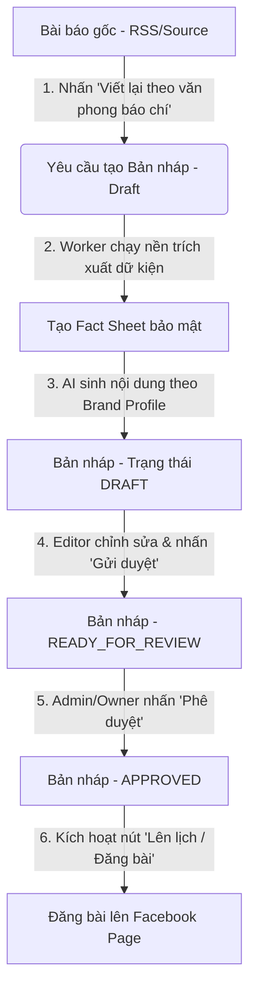
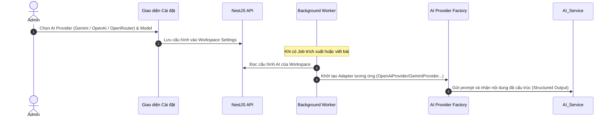

# Tài Liệu Chức Năng & Luồng Hệ Thống (AI & Facebook Posting Flow)

Tài liệu này mô tả chi tiết cách thức hoạt động của luồng đăng bài Facebook (từ bài báo thu thập được sang bài đăng hoàn chỉnh) và phương án tích hợp nhiều nhà cung cấp AI (Multi-provider AI) nhằm tối ưu hóa chất lượng nội dung chuẩn doanh nghiệp (production-grade).

---

## 1. Luồng Xuất Bản Bài Viết lên Facebook (Facebook Publishing Flow)

Hiện tại, giao diện bạn đang xem trong ảnh chụp là **Chi tiết Bài báo gốc (Article Detail)** được quét về từ RSS Báo Chính Phủ. Theo thiết kế chuẩn của hệ thống ToolFace, bài viết không được đăng trực tiếp ngay lập tức mà trải qua quy trình biên tập an toàn (Editorial Workflow) sau:

### Tại sao nút "Đăng bài Facebook" chưa xuất hiện trực tiếp ở chi tiết bài viết?
- **Đảm bảo tính chính xác:** Tránh việc bài báo gốc chưa qua xử lý AI theo ngôn phong và bộ nhận diện thương hiệu (Brand Profile) của bạn đã bị đăng trực tiếp.
- **Quy trình duyệt an toàn:** Tránh biên tập viên đăng nội dung nhạy cảm hoặc sai lệch dữ kiện mà không được kiểm duyệt trước (Fact-checking).

### Đề xuất chức năng cải tiến chuẩn Production (Đăng nhanh - Quick Publish):
Để đơn giản hóa cho người dùng cá nhân/admin muốn bỏ qua quy trình duyệt 2 bước, chúng ta sẽ thêm tính năng:
- **Nút "Đăng nhanh lên Facebook" (Quick Publish) trực tiếp trên trang chi tiết Bản nháp:** Tự động phê duyệt và đẩy bài đăng vào hàng đợi xuất bản ngay lập tức.
- **Tự động phê duyệt (Auto-Approve):** Tùy chọn cấu hình trong cài đặt hệ thống để bỏ qua bước phê duyệt thủ công.

---

## 2. Chức Năng AI Đa Nhà Cung Cấp (Multi-Model AI Integration)

Hiện tại, hệ thống hỗ trợ `gemini` (Gemini API) và `mock` (giả lập). Để hệ thống đạt chuẩn production, chúng tôi đề xuất bổ sung thêm các nhà cung cấp AI phổ biến:

### A. Các nhà cung cấp AI đề xuất tích hợp thêm:
1. **OpenAI (`openai`):** Sử dụng các mô hình `gpt-4o`, `gpt-4o-mini` cho tốc độ xử lý nhanh và độ chính xác dữ kiện cao.
2. **OpenRouter (`openrouter`):** Cho phép kết nối tới hàng trăm mô hình mã nguồn mở và đóng hàng đầu như **Anthropic Claude 3.5 Sonnet**, **Llama 3.1 70B/405B**, **Mistral Large** thông qua một API duy nhất.

### B. Luồng cấu hình và lựa chọn AI linh hoạt:
Chúng ta sẽ mở rộng cấu hình hệ thống bằng cách lưu trữ thông tin AI Provider trong **Cài đặt Workspace (Workspace Settings)** hoặc **Brand Profile** để người dùng lựa chọn:

---

## 3. Các bước triển khai tiếp theo (Implementation Plan)

### Bước 1: Viết mới các AI Provider Adapters
- Tạo `OpenAiProvider` sử dụng thư viện `openai` SDK.
- Tạo `OpenRouterAiProvider` kế thừa từ `OpenAiProvider` nhưng định tuyến qua URL endpoint của OpenRouter.
- Cập nhật module máy chủ Worker để khởi tạo động AI Provider dựa trên cấu hình môi trường hoặc cài đặt Workspace.

### Bước 2: Cập nhật giao diện biên tập bản nháp
- Bổ sung nút **"Đăng nhanh" (Quick Publish)** trong màn hình chi tiết Bản nháp (khi đã kết nối Facebook) giúp bỏ qua bước chuyển trạng thái trung gian.
- Bổ sung menu cài đặt cấu hình AI Provider & Model cho Workspace.
