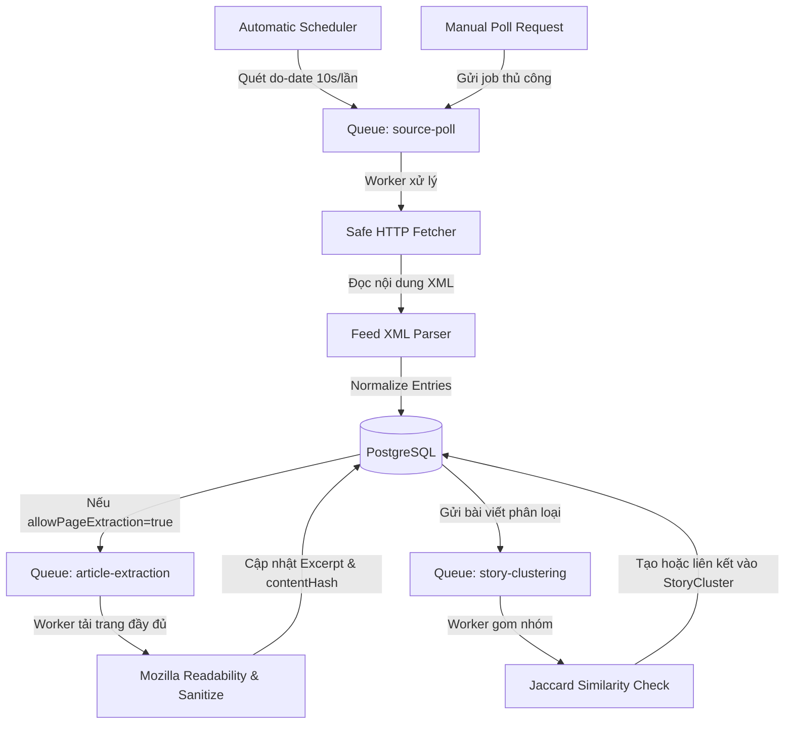

# Kiến trúc Thu thập Tin tức (News Ingestion Architecture)

Kiến trúc luồng xử lý thu thập tin tức của NewsFlow AI được thiết kế dưới dạng luồng dữ liệu một chiều không đồng bộ (Asynchronous Unidirectional Data Flow) sử dụng hàng đợi BullMQ/Redis để phân phối và cân bằng tải.

## Sơ đồ luồng hoạt động (Data Flow)

## Các thành phần chính

### 1. Hàng đợi BullMQ
* **`source-poll`**: Nhận nhiệm vụ tải và phân tích XML của một nguồn tin cấp. Tác vụ này chạy độc lập và song song.
* **`article-extraction`**: Chạy không đồng bộ để bóc tách trang HTML nội dung đầy đủ từ nguồn tin được cấu hình.
* **`story-clustering`**: Thực hiện nhiệm vụ kiểm tra trùng lặp và gom nhóm tin bài dựa trên độ tương đồng tiêu đề.

### 2. Chuẩn hóa & Chống trùng lặp
* **Layer 1 (Canonical URL)**: Chặn trùng lặp tuyệt đối ở mức Workspace sử dụng chỉ mục Unique.
* **Layer 2 (Content Hash)**: Băm SHA-256 nội dung để phát hiện bài viết đăng lại cùng nguồn hoặc khác nguồn.
* **Layer 3 (Title Hash)**: Loại bỏ các khoảng trắng dư thừa, chuyển chữ thường và ký tự đặc biệt trước khi so khớp băm.
* **Layer 4 (Title Similarity)**: Gom cụm các bài viết cùng chủ đề trong khung thời gian 24 giờ sử dụng phép tính trùng lặp từ khoá Jaccard.
