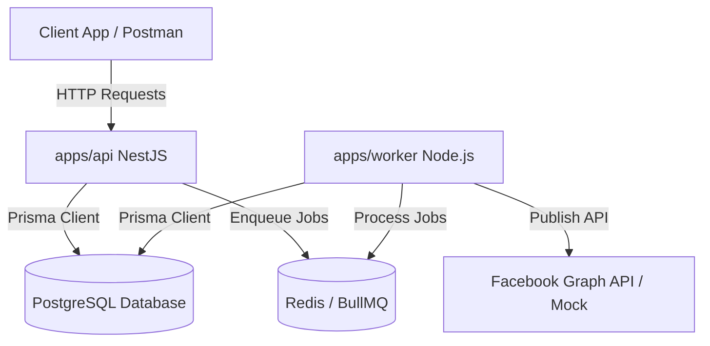
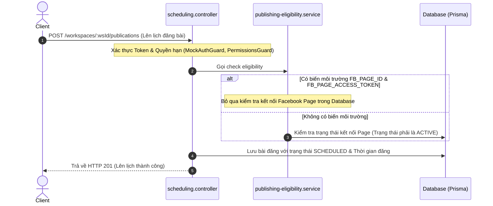
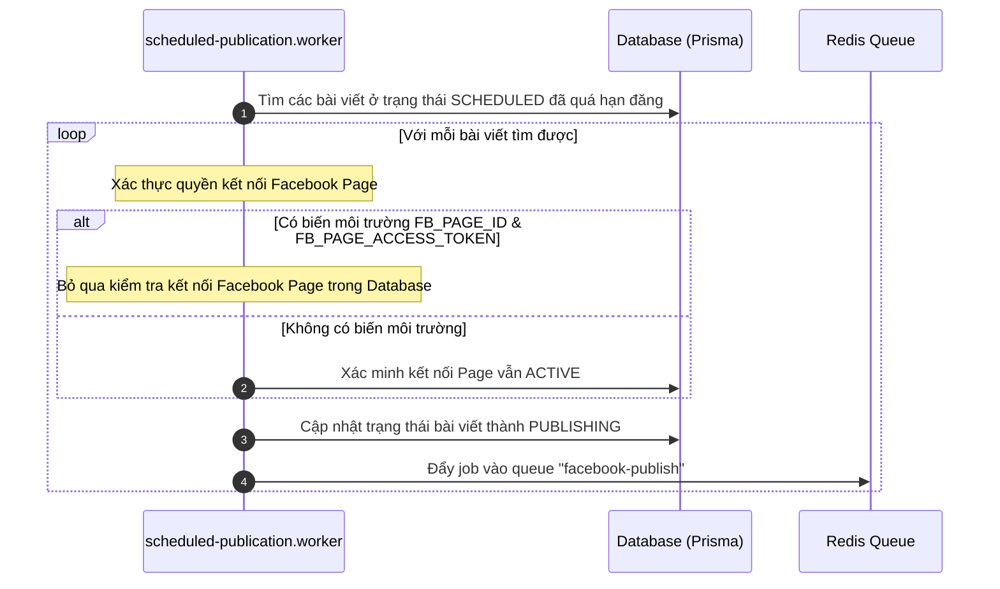
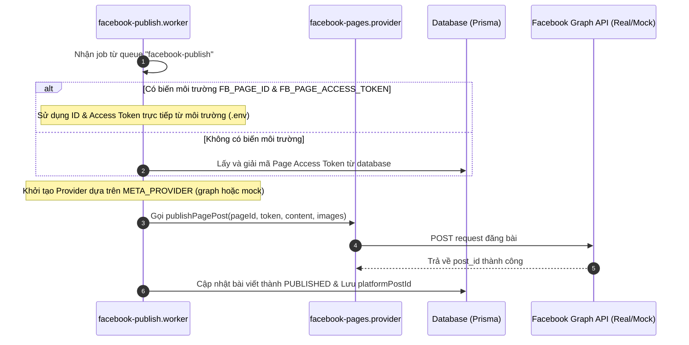

# Sơ đồ Luồng Hoạt động Dự án ToolFace (NewsFlow AI)

Tài liệu này mô tả chi tiết kiến trúc và luồng xử lý đăng bài (Publishing Flow) hiện tại của dự án ToolFace, bao gồm cả cơ chế ghi đè thông tin bằng biến môi trường (Environment Variable Override) mới tích hợp.

---

## 1. Tổng quan Kiến trúc

Hệ thống được thiết kế theo mô hình Monorepo chia thành các ứng dụng (`apps`) và thư viện chia sẻ (`packages`):



- **`apps/api` (NestJS)**: Cung cấp API phục vụ Client, xử lý Authentication, Authorization, quản lý Brand Profiles và lên lịch bài đăng (Scheduling).
- **`apps/worker` (Node.js)**: Chạy các tiến trình xử lý hàng đợi BullMQ trong nền để tìm kiếm các bài viết đến hạn và đẩy sang tiến trình đăng bài lên các MXH (Facebook).
- **`packages/database`**: Chứa Prisma Client và các Social Providers (Mock hoặc Real Graph API) để tương tác trực tiếp với API Facebook.

---

## 2. Luồng Lên lịch & Đăng bài (Scheduling & Publishing Flow)

Chi tiết luồng hoạt động từ lúc lên lịch bài đăng cho đến khi bài viết được xuất bản thành công lên Facebook:

### Giai đoạn 1: Lên lịch bài đăng (API)



---

### Giai đoạn 2: Quét bài viết đến hạn (Scheduled Publication Worker)

Mỗi chu kỳ quét (cron job của BullMQ):



---

### Giai đoạn 3: Đăng bài lên Facebook (Facebook Publish Worker)



---

## 3. Cơ chế Ghi đè bằng Biến môi trường (Environment Overrides)

Để hỗ trợ phát triển nhanh và chạy tự động bài đăng mà không cần thiết lập luồng kết nối OAuth phức tạp trên Database, dự án hỗ trợ cấu hình trực tiếp các biến môi trường trong file `.env`:

```env
# Kích hoạt provider thật thay vì Mock
META_PROVIDER=graph

# Thông tin Fanpage đăng bài ghi đè trực tiếp
FB_PAGE_ID=1206185872579017
FB_PAGE_ACCESS_TOKEN=EAAXFgFy9...
```

Khi cấu hình này tồn tại:
1. **API**: Bỏ qua các bước kiểm tra cấu hình kết nối fanpage trong bảng `PageConnection`.
2. **Scheduled Worker**: Cho phép lên lịch bài đăng mà không bắt buộc workspace phải liên kết fanpage từ trước.
3. **Facebook Worker**: Sử dụng trực tiếp `FB_PAGE_ACCESS_TOKEN` để gọi API Facebook Graph thay vì giải mã token của page liên kết từ database.
